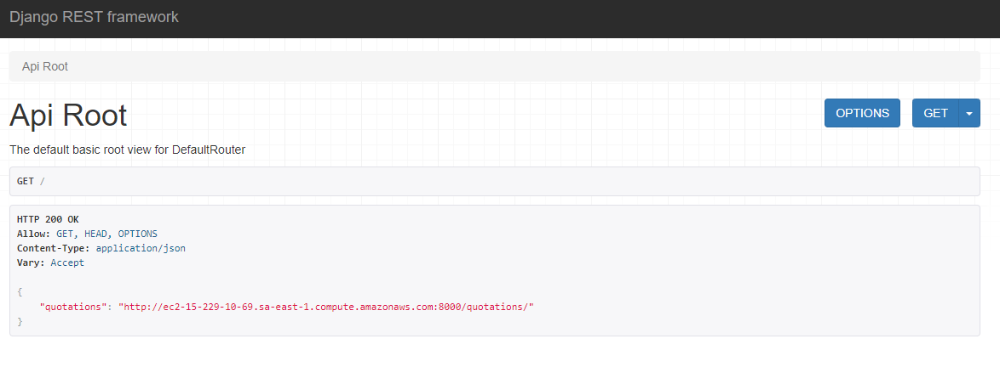
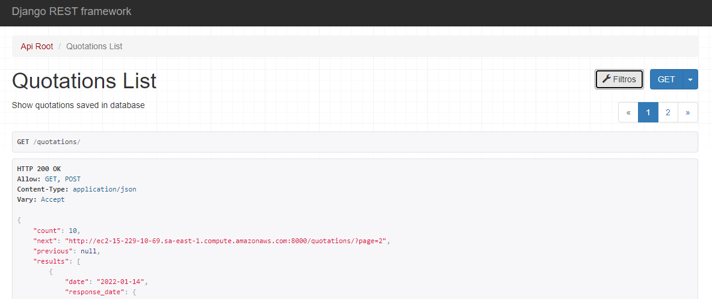
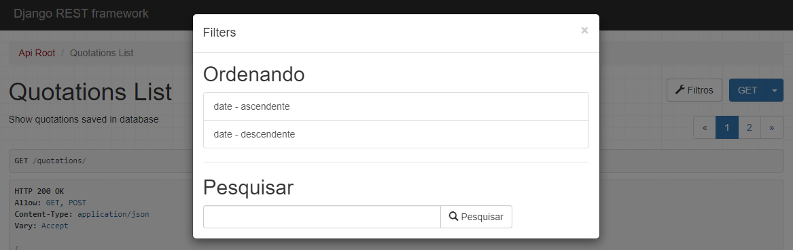
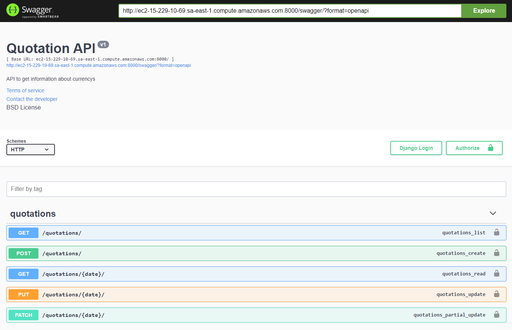
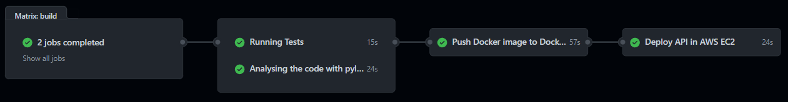

# Quotation API

> This project focused on the development of an API to retrieve information about the quotes of several currencies in the financial market. The entire project was documented using python language conventions. Also, you can see the CI/CD pipeline in the Actions tab of this repository. In addition, some of the interesting features we have are the implementation of a middleware that checks for new quotes in every request, thus always returning the most recent possible, a view was also implemented that allows the interaction with the API in a more graphic way. You can preview the project using the following link: [Quotation API](http://ec2-15-229-10-69.sa-east-1.compute.amazonaws.com:8000).

## Requirements
Tools and packages required to successfully install this project.

* Python 3.8 or later: [Download link](https://www.python.org/downloads/).

## Installation:
A step by step list of commands that informs how to install an instance of this project.

```sh
$ git clone https://github.com/DaviSegundo/Quotation_API.git
```

```sh
$ python -m venv venv
```

```sh
$ pip install -r requeriments.txt
```

```sh
$ python manage.py migrate
```

```sh
$ python manage.py runserver
```

## Screenshots

<p align='center'>
    
</p>
<hr>
<p align='center'>
    
</p>
<hr>
<p align='center'>
    
</p>
<hr>
<p align='center'>
    
</p>

## Features/Details

* Custom Middleware to get new quotations.
* API View and features to order & search.
* Third-party API request.
* Database query and populate.
* Cache information of request.
* Swagger Documentation.

## Principal Routes Code
- Using Third-party API and Query Parameters
```py
def last_days_quotations(request):
    """Return last days quotations of a currency.

    Keyword arguments:
    request -- parameters [ days, currency ]
    """
    args = request.GET
    days = int(args.get('days', None))
    currency = args.get('currency', None)

    quotations = Quotation()
    quotations_list = quotations.get_past_days(days=days, currency=currency)

    return JsonResponse(quotations_list)
```

- Using Database and URL Path
```py
def db_last_days_quotations(request, days: int, currency: str):
    """Request to get last days quotations of database

    Keyword arguments:
    days -- last days
    currency -- type of cash
    """
    if request.method == 'GET':
        dates = working_days(days=days)
        currency = currency.upper()
        quotations = []
        for date in dates:
            info = Quotation.objects.filter(date=date).first()
            value = info.response_date.get('rates').get(currency)
            response = {"date": info.date, "currency": value}
            quotations.append(response)
        quotations.reverse()
        final_response = {"quotations": quotations, "currency": currency.upper()}

    return JsonResponse(final_response)
```
> This is the route that will return quotes from the last 5 working days of the chosen currency.

## Deployment Notes

This project has an automatic deployment pipeline, that is, CI/CD, for that GitHub Actions was used to do the workflow. Some of the details were building a Docker container and deploying it to an EC2 AWS instance. Other important steps are static code analysis using Pylint and application testing.

### Docker image

You can pull the Docker image for local testing with the command:

```sh
$ docker pull davisegundo88/api_quotation_container:develop
```

Or you can use the Dockerfile to perform the local build:

```sh
$ docker build -f Dockerfile -t davisegundo88/quotation_api .
```

### Pipeline

You can see the steps of the deployment workflow in the image below:

<p align='center'>
    
</p>

## Authors

Davi Segundo Pinheiro – davisp2009@hotmail.com

You can find me here at: 
Github - [Davi S.P](https://github.com/DaviSegundo)
LinkedIn - [Davi Segundo](https://www.linkedin.com/in/davi-segundo-881401210/)